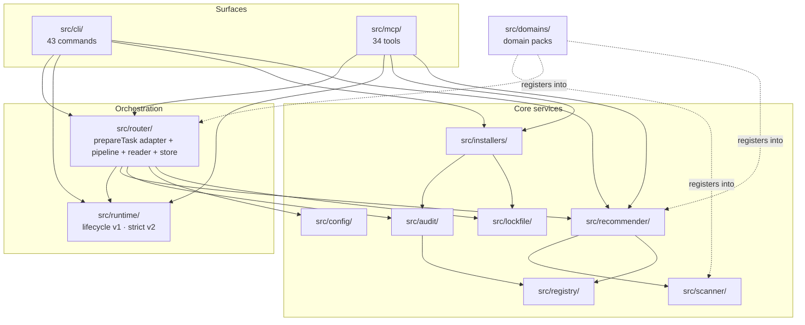
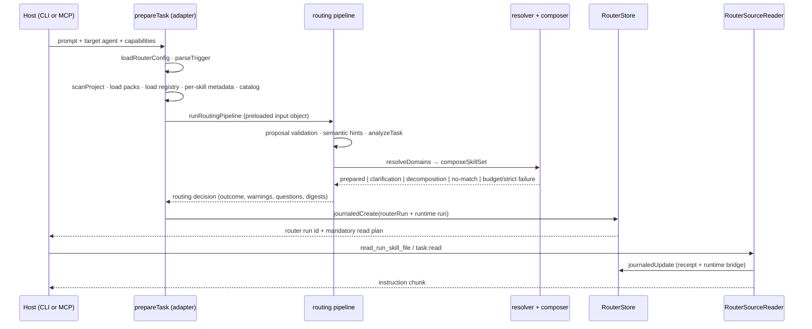

# Architecture

This document describes SkillRanger as it is implemented today. Every claim is anchored to a real
file or directory. Where the code and an older design intent diverge, the current behaviour is
described first and the divergence is noted separately in
[Known divergences](#17-known-divergences).

For a short project orientation, read [`../README.md`](../README.md).

---

## 1. Purpose and boundaries

SkillRanger is a local-first router and package manager for AI agent skills. Given a repository and
a task, it:

1. fingerprints the project (`src/scanner/`),
2. selects a small, compatible skill set (`src/recommender/`, `src/router/`),
3. audits the skill packages (`src/audit/`),
4. installs them behind a reviewable plan and a checksum lockfile (`src/installers/`, `src/lockfile/`),
5. serves their instructions to the host agent under a persisted run (`src/runtime/`, `src/router/reader.ts`).

**What it does not do.** SkillRanger itself never calls a model, never executes a skill's code, and
never edits application source. In catalog-assisted MCP routing, the host agent may use its model to
submit a prompt-grounded skill nomination; SkillRanger validates that proposal and owns catalog trust,
hard vetoes, composition, and runtime integrity. Installed skill packages are static instruction
files. The host agent — Codex, Claude Code, Cursor, OpenCode, Gemini CLI, or any MCP host — owns all
model calls and all code changes. This boundary is stated in [`workflow-runtime.md`](workflow-runtime.md)
and enforced structurally: nothing in `src/` spawns a child process except the eval harnesses
(`src/evals/process.ts`, `src/evals/runner.ts`), the optional host browser adapter
(`src/domains/frontend/design/adapter.ts`), and strict source-control snapshots
(`src/runtime/strict/git.ts`), which run read-only `git rev-parse` and `git diff` commands.

**Zero runtime dependencies.** `package.json` declares no `dependencies`; devDependencies are only
`@types/node` and `typescript`. The CLI parser (`src/cli/commands.ts`), the JSON-RPC layer
(`src/mcp/protocol.ts`), the manifest validator (`src/registry/validation.ts`), and the JSON-Schema
validator (`src/runtime/strict/json-schema.ts`) are all hand-written.

**Two entry points**, both declared in `package.json:bin`:

| Binary | Source | Compiled |
| :--- | :--- | :--- |
| `skillranger` | `src/cli/index.ts` | `dist/cli/index.js` |
| `skillranger-mcp` | `src/mcp/server.ts` | `dist/mcp/server.js` |

Source files run directly on Node 22+ through native TypeScript type-stripping. Node 20 is supported
only through the compiled `dist/` output, which is why CI has a dedicated `node20-compiled-smoke` job.

---

## 2. Component map



---

## 3. Directories and responsibilities

### `src/`

| Path | Responsibility |
| :--- | :--- |
| `cli/index.ts` | Command dispatch and human-facing output (~1.3k lines, a single `run()` function) |
| `cli/commands.ts` | Declarative command schema; `parseCliInvocation`, help rendering |
| `cli/task.ts` | `task` / `task:read` handlers over the router |
| `cli/runs.ts` | The 13 `run:*` handlers over both runtimes, with per-error-code remediation text |
| `cli/visual-eval.ts` | `eval:visual` handler |
| `cli/release.ts` | `release:validate` and `release:certify` handlers |
| `cli/setup-recommendations.ts` | Pure helper that dedupes recommendations across target agents |
| `mcp/server.ts` | stdio readline loop |
| `mcp/protocol.ts` | JSON-RPC 2.0 framing, `initialize` / `tools/list` / `tools/call` |
| `mcp/tools.ts` | Tool aggregation and `callMcpTool` dispatch with argument validation |
| `mcp/tools/*.ts` | The eight tool groups plus shared `types.ts` / `utils.ts` |
| `mcp/router-context.ts` | The fixed, canonicalized project root for router tools |
| `router/` | 28 modules; see [§7](#7-router-lifecycle) |
| `runtime/skill-run/` | Lifecycle v1 state machine, store, verification |
| `runtime/strict/` | Strict v2 state machine, contracts, evidence, certification |
| `runtime/run-lock.ts` | The file lock shared by every store |
| `runtime/verification.ts` | Runtime-agnostic report construction and outcome resolution |
| `registry/` | `index.ts` loads and checksums packages; `validation.ts` validates manifests and content |
| `scanner/` | `index.ts:scanProject`; `providers.ts` holds the pluggable signal-provider registry |
| `recommender/` | `index.ts:recommendSkills`; `scoring.ts` holds feature vectors and weights |
| `installers/` | `agents.ts` (targets), `codex.ts` (the single adapter factory), `installed-path.ts`, `verify.ts`, `uninstall.ts`, `agent-context.ts` |
| `audit/index.ts` | `auditSkill` — static pattern scan over a package |
| `lockfile/index.ts` | `skillranger.lock.json` read/validate/write |
| `config/` | `skillranger.config.json` defaults, exact-key validation, canonical digest |
| `release/` | Frontend 0.5.0 artifact validation and retained evidence certification |
| `domains/` | `types.ts` (pack contract), `registry.ts` (validation + in-memory registry), `bundled.ts` (side-effect registration), `frontend/` |
| `evals/` | `frontend.ts`, `router/index.ts`, `visual/`, plus the generic `runner.ts` |
| `paths.ts`, `types.ts`, `version.ts` | Leaf modules; `paths.ts` resolves package-relative roots only |

### Data directories (shipped in the npm package)

| Path | Contents |
| :--- | :--- |
| `registry/skills/` | 18 skill packages, all `frontend.*` |
| `registry/contracts/frontend/` | 3 shared contracts, materialized into installs as `references/shared/frontend--<name>.md` |
| `domains/frontend/` | Domain manifest, routing vocabulary, 14 schemas, release manifest, rules, 8 recipes, 8 example packs, workflows, validators |
| `schemas/` | 16 published JSON Schemas |
| `evals/frontend/` | Frozen eval suite, promotion slices, visual benchmark |
| `fixtures/` | `next-react-ts`, `vite-react-ts`, `backend-node`, `malicious-skill` |

---

## 4. Dependency direction

Dependencies flow one way; no cycles.

- `src/types.ts` and `src/paths.ts` are leaves.
- `recommender` → `scanner` and `registry`.
- `audit` → `registry`. `installers` → `audit` and `lockfile`.
- `router` → `config` and `runtime` (creation and reads).
- `router` and `runtime` are consumed by both surfaces (`src/mcp/tools/*`, `src/cli/*`).

Two deliberate exceptions worth knowing:

- `src/runtime/strict/service.ts` imports `PreparedSelections` from `src/router/types.ts` — **type-only**.
  There is no value-level edge from runtime back to router.
- `src/cli/index.ts` reaches the MCP server through a single lazy `await import("../mcp/server.ts")`
  for the `mcp` command. That is the only CLI → MCP edge.

`src/domains/bundled.ts` is an eight-line side-effect module imported by `src/recommender/index.ts`,
`src/cli/index.ts`, and `src/mcp/tools/domains.ts`. Importing it is what populates both the
domain-pack registry and the scanner's signal-provider registry.

---

## 5. CLI flow

`src/cli/commands.ts` holds `cliCommandDefinitions` — a frozen array of 43 commands, each declaring
its `booleanOptions` and `valueOptions`. `parseCliInvocation(argv)` rejects single-dash flags and any
undeclared flag, and returns a `help` / `version` / `command` invocation.

`run()` in `src/cli/index.ts` offers the invocation to four sub-handlers in order — each returns
whether it claimed the command — and then falls through to its own dispatch chain:

```text
parseCliInvocation
  → handleVisualEvalCommand   (eval:visual)
  → handleReleaseCommand      (release:validate, release:certify)
  → handleTaskCliCommand      (task, task:read)
  → handleRunCliCommand       (13 run:* commands)
  → inline dispatch           (scan, recommend, setup, install, audit, domain:*, design:*, …)
```

The registry root is always `defaultRegistryRoot` from `src/paths.ts` — the CLI never accepts an
arbitrary registry path.

Command groups: `task*`, `scan`, `recommend`, `setup`, `install` / `installed` / `verify` /
`uninstall`, `audit` / `validate:registry` / `lint:skills` / `audit:registry` / `publish:check`,
`release:validate` / `release:certify`, `domain:*`, `design:*` (8 frontend design-pipeline commands),
`run:*` (7 lifecycle-v1 + 6 strict), `eval:frontend` / `eval:visual`, `mcp`, `doctor`.

`src/cli/task.ts` maps router outcomes to distinct process exit codes so scripts can branch without
parsing text: `2` clarification required, `3` decomposition required, `4` no matching skills,
`5` strict requirements unmet, `6` context budget exceeded, `1` any other error.

---

## 6. MCP request flow

Transport is **newline-delimited JSON-RPC 2.0 over stdio** — one JSON object per line, no
`Content-Length` framing and no MCP SDK. Protocol version `2025-06-18`; capabilities are
`{ tools: { listChanged: false } }`.

```text
stdin line
  → src/mcp/server.ts        readline, one object per line
  → src/mcp/protocol.ts      handleJsonRpcLine → handleJsonRpcRequest
  → src/mcp/tools.ts         callMcpTool(name, args)
       ├─ unknown name  → coded "unknown-tool" result
       ├─ validateJsonSchema(definition.inputSchema, args)   [non-router tools only]
       └─ handler → core service (router / runtime / registry / installers / domains)
```

`startMcpServer()` calls `initializeRouterContext()` first. That canonicalizes
`SKILLRANGER_PROJECT_ROOT ?? process.cwd()` through `realpathSync` and freezes it for the process
lifetime. Router tools therefore take **no** `projectRoot` argument; supplying one returns
`project-root-unauthorized`.

The 34 tools, by group:

Catalog discovery is a dedicated read-only boundary: `inspect_skill_catalog` delivers the complete
trusted bundled skill catalog before a host submits a catalog-bound routing proposal to `prepare_task`.
The final catalog receipt proves delivery of that snapshot, not model comprehension.

| Group (`src/mcp/tools/…`) | Tools |
| :--- | :--- |
| `project.ts` | `analyze_project`, `recommend_skills` |
| `catalog.ts` | `inspect_skill_catalog` |
| `registry.ts` | `audit_skill` |
| `install.ts` | `list_installed_skills`, `plan_skill_install`, `install_skill` |
| `domains.ts` | `list_domains`, `inspect_domain`, `create_frontend_design_brief`, `recommend_frontend_recipe`, `validate_frontend_result`, `compile_frontend_design_spec`, `verify_frontend_result`, `repair_frontend_result`, `run_domain_eval` |
| `runs.ts` | lifecycle v1: `start_skill_run`, `record_skill_read`, `resolve_skill_run_clarifications`, `begin_skill_run_execution`, `complete_skill_run`, `verify_skill_run`, `inspect_skill_run` · strict v2: `read_next_skill_chunk`, `begin_skill_step`, `add_skill_evidence`, `complete_skill_step`, `verify_skill`, `finalize_skill_run` |
| `visual.ts` | `capture_ui_evidence`, `compare_design_variants`, `verify_visual_result` |
| `router.ts` | `prepare_task`, `read_run_skill_file` |

`mcpTools.length` is the authoritative count — re-derive it rather than trusting this table.

Every definition carries effect metadata from `src/mcp/tools/types.ts`: an `McpToolEffect` of
`read-only`, `exact-install-plan`, `run-state-write`, or `command-and-artifact-write`, surfaced to
hosts as MCP `annotations` plus `_meta["skillranger/effect"]` and `_meta["skillranger/confirmation"]`
(`none` | `host-managed` | `required`). `capture_ui_evidence` is the only tool that runs a host
command, and it requires an explicit `confirm: true`. See [`mcp-host-config.md`](mcp-host-config.md).

**Router tools are excluded from central argument validation on purpose.** They enforce their own
argument contract so that an injected `projectRoot` maps to the trust-boundary error code rather than
a generic schema error — the reasoning is in the comment at `src/mcp/tools.ts` and in
[ADR 0001](adr/0001-universal-prompt-router-boundaries.md).

---

## 7. Router lifecycle

`prepareTask` in `src/router/prepare.ts` is the single core service behind both CLI `task` and MCP
`prepare_task`. It loads everything (config, fingerprint, packs, registry, per-skill metadata, routing
context, catalog) and delegates the whole routing decision to the routing pipeline
(`runRoutingPipeline` in `src/router/pipeline.ts`) — a deterministic, in-memory function from one
preloaded input object to a routing decision (outcome, selections, warnings, clarification questions
with eligibility, rejection reasons, digests). The adapter maps that decision onto the public
preparation result; continuation tokens, the deterministic persistence key, and strict feasibility
stay in the adapter. Algorithm version is pinned as `routerAlgorithmVersion = "router/2.1"` in the
pipeline module.



Ordered stages inside `prepareTask`:

1. **Config** — `loadRouterConfig(projectRoot)`; a disabled router fails with `router-disabled`.
2. **Trigger** — `parseTrigger` (`src/router/trigger.ts`). Aliases `@skillranger`, `skillranger`,
   `/sr` at the end of the prompt; `@skillranger` and `/sr` also at the start. Matches inside code
   spans or URLs are rejected. CLI `task` uses direct activation instead.
3. **Context gathering** — `scanProject`, bundled domain packs (or fixture packs in tests), and the
   local registry, in parallel.
4. **Per-skill metadata** — for each registry skill: `auditSkill`, the matching lockfile entry, the
   resolved installed root, and `assertInstalledMatches`. A skill is `installed` only when all three
   agree.
5. **Routing context** — `buildRoutingContext` (`src/router/context.ts`) compiles one deterministic
   vocabulary from `src/router/vocabulary/core.ts` plus each pack's `routingVocabulary`. Cross-owner
   collisions and undeclared IDs fail loading; every failure collapses to `routing-integrity`.
6. **Pipeline** — `runRoutingPipeline(input)` asserts proposal/semantic-hints mutual exclusion, then
   runs proposal validation (shape, catalog binding, semantics), task analysis, nomination
   resolution, domain resolution, the retrieval boundary, composition, outcome mapping, and warning
   aggregation — all deterministically in memory, returning a routing decision. A stale catalog
   binding returns a `catalog_refresh_required` decision that the adapter maps onto the public
   refresh result.
7. **Branch** — the adapter shapes the decision: clarification (returns a signed continuation token,
   HMAC-SHA256, 15-minute TTL, bound to the decision's question eligibility) / decomposition / no
   match / composition results. Unmet strict requirements and strict feasibility remain adapter
   concerns: the pipeline reports `strict-requirements-unmet`, the adapter produces the public
   `strict_requirements_unmet` outcome with installation suggestions.
8. **Snapshot** — `createSkillSourceSnapshots` (`src/router/reader.ts`) pins package, root, file, and
   chunk checksums into a source inventory.
9. **Runtime** — a strict run (`createPreparedStrictSkillRun`) or a lifecycle-v1 run
   (`createSkillRun` + a `select-skills` reduction).
10. **Persist** — `store.journaledCreate` writes the router sidecar and the runtime record atomically.

Result statuses: `prepared`, `clarification_required`, `decomposition_required`,
`no_matching_skills`, `strict_requirements_unmet`, `context_budget_exceeded`. Only `prepared` writes
a run; the others create nothing partial.

**Progressive reads.** `RouterSourceReader.read` serves one file at a time. It re-verifies the root
identity, the package checksum, and the per-file checksum before returning bytes (`stale-skill-checksum`
otherwise); requires reads in inventory order (`read-order-invalid` on a revision mismatch); and
enforces a separate byte budget for optional files. Replaying a `readRequestId` is idempotent. When a
skill's mandatory reads complete, the reader bridges into the runtime — lifecycle v1 gets a
`record-skill-read` event with `source: "content-delivered"`, strict v2 drains `readNextStrictChunk`
until every chunk has a receipt.

Routing performs no network calls, no package installation, no child processes, and no application
edits. Production flows use the bundled registry; the synthetic packs in `tests/fixtures/router-packs/`
are dependency-injected data fixtures for tests and evals only (`src/router/fixtures.ts`).

---

## 8. Skill discovery, installation, and registry

**Registry loading** — `loadLocalRegistry(registryRoot)` in `src/registry/index.ts`. The registry root
may contain only `skills` and `contracts`; a skill directory may contain only an allowlisted set of
entries (`SKILL.md`, `skill.manifest.json`, `references/`, `execution.contract.json`, …). Hidden files
are rejected anywhere. Each package is validated (`assertValidSkillManifest`, then `validateSkillContent`),
its shared contracts resolved, its execution contract cross-checked when `contractVersion` is `"2.0"`,
and its checksum computed.

`computeSkillChecksum` hashes `relative-path \0 bytes \0` for every file in sorted order, plus each
shared contract under its install path, yielding `sha256:<hex>`. This value is the identity of a skill
package everywhere else in the system.

**Scanning** — `scanProject` (`src/scanner/index.ts`) produces a `ProjectFingerprint`
(`schemaVersion: "1.0"`). Built-in detection is deliberately thin: package manifest, TypeScript /
JavaScript / Python, test runners, Docker, package manager, folder signals, and agent context
(`AGENTS.md`, `.agents/skills`, `.claude/skills`). Framework, styling, and project-type detection is
delegated to signal providers registered through `src/scanner/providers.ts`. File scanning caps at 500
entries and emits a truncation warning.

**Recommendation** — `recommendSkills` (`src/recommender/index.ts`) filters by domain-pack
`rejectIntent`, target-agent compatibility, stack-tag overlap, and `includeSkill`, then scores each
candidate. Weights and the breakdown keys live in `src/recommender/scoring.ts` — read them there
rather than restating them; the breakdown is surfaced verbatim so CLI and MCP hosts can explain a
recommendation. Lanes are `framework`, `design`, `implementation`, `qa`, `agent-context`
(`src/types.ts:skillLanes`), and callers can filter to one lane or cap each with `limitPerLane`.

**Audit** — `auditSkill` (`src/audit/index.ts`) walks the package and its shared contracts. Findings
are graded `low` / `medium` / `high` / `block`; the report's risk level is the maximum of the manifest
risk and the findings. See [§12](#12-error-boundaries-and-security-sensitive-code).

**Install** — target agents are declared in `src/installers/agents.ts`: `claude-code`, `codex`,
`cursor`, `gemini-cli`, `generic-agent-skills`, `opencode`, `universal`. Despite its filename,
`src/installers/codex.ts` is the **generic** adapter factory serving every target — `getAdapter(target)`
returns an adapter built from the same code path.

The install model is canonical-plus-link: files land in `.agents/skills/<slug>/`, and the agent's own
directory (`.claude/skills/` for Claude Code, `.agents/skills/` for everything else) becomes a relative
directory symlink to it — a junction on Windows, falling back to a copy with a plan warning. `--copy`
writes directly instead. `applyInstall` re-audits, throws `InstallAuditBlockedError` when the risk is
`block`, stages with backup and atomic swap, asserts package integrity before and after staging, and
finally calls `upsertInstalledSkill`.

`src/installers/agent-context.ts` maintains an idempotent block between `<!-- SKILLRANGER_START -->`
and `<!-- SKILLRANGER_END -->` markers in the **target project's** `AGENTS.md`. Malformed or duplicated
markers throw rather than guess. That block is the canonical statement of the trigger contract.

`verifyInstalledSkills` (`src/installers/verify.ts`) reports `verified` / `missing` / `modified` /
`invalid-path` per lockfile entry. `planUninstall` refuses to remove anything whose checksum has
drifted or whose content was modified, and preserves the shared canonical package while another target
still references it.

---

## 9. Runtimes

A prepared run is one of two kinds, recorded in `routerRun.runtime.kind`.

### Lifecycle v1 — `src/runtime/skill-run/`

States (`types.ts:SkillRunState`):

```text
created → skills-selected → skills-read → clarified → running → implemented
                                                                   ├→ verified
                                                                   ├→ implemented-unverified
                                                                   ├→ failed
                                                                   └→ blocked
```

`reduceSkillRun` (`reducer.ts`) is the only transition function. Notable checks: a recorded read's
checksum must equal the selected snapshot's (`stale-skill-checksum`); read provenance is `attested` or
`content-delivered` and upgrades monotonically; execution cannot start until clarifications are
resolved or explicitly declined with an assumption, and every mandatory skill has been read.

**What `verified` means here.** `record-verification` produces `verified` only when the verification
status is `passed`, hard gates passed, there are no hard-gate findings, there is at least one evidence
entry, evidence snapshots exist and match the evidence entries one-to-one, every snapshot path is
project-relative with an integer byte length and a canonical sha256, and every mandatory skill was
delivered as `content-delivered` — an attested read is not enough. Anything else is
`verification-blocked`.

`src/runtime/verification.ts` is runtime-agnostic: `resolveVerificationOutcome` short-circuits on
blocked/failed, downgrades to `implemented-unverified` on degraded capability or partial verification,
and `createRepairRequest` caps iterations at an integer 1–5.

### Strict v2 — `src/runtime/strict/`

States (`types.ts:StrictSkillRunState`):

```text
planned → reading → ready → running → verifying → {repair-required ⇄ running} → verified | blocked | failed
```

Each selected skill carries a ledger with an outcome of `used`, `no-op`, or `blocked`. Strict runs are
installed-only: a skill qualifies only with a lockfile entry whose checksum matches the registry,
`execution.contractVersion === "2.0"`, contained `inputSchema` / `outputSchema` / `mustRead` paths, and
a passing input-schema validation (`assertInstalledMatches`, `installedSelection` in `service.ts`).

Execution is step-wise: one active step run-wide, all content chunks read before the first step,
evidence attributed to the active attempt with rule IDs that exist in the snapshotted contract, and
`completeStrictStep` requiring every declared `requiredEvidenceKinds`. Verification re-reads every
staged artifact and re-checks size and sha256 (`deriveStrictValidatorResults`); a mismatch fails
`artifactIntegrity`. Failing a hard gate opens a bounded repair loop up to `maxRepairIterations`,
after which the ledger is `blocked`.

**Finalization is the integrity anchor.** Two invariants in `src/runtime/strict/store.ts`:

- `update()` throws `run-integrity` if a caller tries to move a run into `verified`. Only
  `finalizeRun` may mint that state.
- `finalizeRun()` short-circuits on `current.state === "verified"` **only** — the verified state is the
  sole proof that finalization completed. A blocked run stays re-finalizable, and a re-finalize that
  produces the same state skips the write so revision and timestamps do not drift.

Before finalizing, every `used` ledger is re-derived: artifact integrity must pass, and the stored
verification report must equal a freshly computed certification projection. `assertFinalizedVerified`
(`finalization.ts`) is shared by the CLI and MCP: the terminal state is still persisted, but a
non-`verified` terminal state is reported as a `run-blocked` error carrying per-skill diagnostics
(`unmet-prerequisites` vs `hard-gates-failed`).

### Locking

`RunFileLock` (`src/runtime/run-lock.ts`) guards `SkillRunStore`, `StrictSkillRunStore`,
`RouterStore`, and the lockfile. It publishes a guard directory by atomic `rename` with dev/inode
confirmation, records owner metadata including a process-identity token, reclaims stale locks after a
bounded age, and times out acquisition. Release is deliberately deadline-free.

---

## 10. Domain packs

The pack contract is `src/domains/types.ts`. `DomainPackManifest` is a discriminated union on
`schemaVersion`: `"1.0"`, `"1.1"`, or `"1.2"`. Version 1.1 adds `artifacts.routingVocabulary` and upgrades
`requiresEvidence` from a string list to a typed `RequiredEvidenceRef { kind, id, allowedSources }`,
where sources are restricted to `prompt-exact`, `prompt-normalized`, `prompt-inferred`. That
restriction is the reason project fingerprints and host semantic hints can never, on their own,
satisfy an ownership rule.

Version 1.2 adds the release identity and `artifacts.releaseManifest` fields used by the frontend
0.4.0 certification contract; version 1.0 and 1.1 manifests remain valid without those fields.

A pack contributes: routing policy (`rejectIntent`, `laneAdjustment`, `skillAdjustment`,
`includeSkill`, `compose`), a run policy, project signal providers, an ownership-intent list, a routing
vocabulary, and optional schemas/rules/recipes. Core owns everything else.

`src/domains/registry.ts` hand-validates manifests (unknown-property rejection, safe relative paths,
`skillIdPrefix` must end with `.`, duplicate-intent and alias-collision detection), holds the in-memory
registry, loads bundled packs from `domains/` with folder-name-equals-manifest-id enforcement, and
confines `evalSuite` resolution to the package root.

`domains/frontend/` is the only bundled pack and the reference implementation: `schemaVersion 1.2`,
`skillIdPrefix "frontend."`, nine ownership intents, an owner-scoped routing vocabulary, 14 schemas,
six rule families, eight recipes, and eight example packs. Its implementation lives in
`src/domains/frontend/` — routing policy, phases, run policy, bilingual intent lexicons
(`intents/en.ts`, `intents/ru.ts`), and the ~30-module `design/` pipeline. Executable third-party packs
are not supported in v1.

See [`domains/README.md`](domains/README.md) and
[`domains/creating-a-domain-pack.md`](domains/creating-a-domain-pack.md).

---

## 11. Contracts, schemas, and validation

`schemas/` holds 16 published JSON Schemas, all with `$id: https://skillranger.local/schemas/…`:

| Schema | Describes |
| :--- | :--- |
| `registry.schema.json` | Skill manifest |
| `lockfile.schema.json` | `skillranger.lock.json` |
| `router-config.schema.json` | `skillranger.config.json` |
| `fingerprint.schema.json` | Scanner `ProjectFingerprint` |
| `task-profile.schema.json` | Normalized task profile |
| `task-routing-result.schema.json` | Routing result envelope |
| `router-run.schema.json` | Persisted router run |
| `router-tool-result.schema.json` | Output union of `prepare_task` / `read_run_skill_file` |
| `router-vocabulary.schema.json` | Routing vocabulary packs |
| `skill-run.schema.json` | Lifecycle-v1 run |
| `skill-run-v2.schema.json` | Strict-v2 run |
| `execution-contract-v2.schema.json` | Per-skill `execution.contract.json` |
| `critic-report-v2.schema.json` | Critic evidence |
| `verification-report-v2.schema.json` | Strict gate results |
| `repair-request-v2.schema.json` | Bounded repair request |
| `domain-manifest.schema.json` | `domains/<id>/domain.manifest.json` |

Two facts that are easy to get wrong:

- **Validation is hand-written TypeScript, not schema-driven.** Skill manifests are validated by
  `src/registry/validation.ts`; MCP tool arguments and strict contracts by
  `src/runtime/strict/json-schema.ts`; router config by `src/config/validation.ts` (exact key match —
  unknown *and* missing keys are both rejected). The schema files document the external contract for
  hosts and tooling.
- **`schemas/router-tool-result.schema.json` is the only schema file `src/` loads at runtime**
  (`src/mcp/tools/router.ts`). Its `$id` is deliberately stripped when deriving the two router output
  schemas, because host SDKs cache validators by `$id` and a shared id would bind one tool's validator
  to the other.

`domains/frontend/schemas/` holds 14 further domain-local schemas that are owned by the pack, not Core.

---

## 12. Lockfile, hashes, evidence, and integrity

**`skillranger.lock.json`** (`src/lockfile/index.ts`, `schemaVersion: "1.0"`). Each `installed[]` entry
records `skillId`, `version`, `checksum`, `targetAgent`, `scope`, `installedPath`, `source`, and the
`audit` result. `assertValidLockfile` enforces id patterns, `sha256:<64 hex>` checksums, relative
non-traversing paths, a valid risk level, a security score in `[0,1]`, and uniqueness of
`(skillId, targetAgent, scope)`. Writes go through `withLockfileTransaction`: acquire the lock,
re-read and re-validate, then `open(…, "wx")` a temp file and `rename` it into place. Malformed JSON
produces an explicit "restore from version control" error rather than a silent reset.

The lockfile is the integrity anchor for routing and strict execution — both `src/router/prepare.ts`
and `src/runtime/strict/service.ts` require `entry.checksum === skill.checksum` before a skill counts
as installed.

**On-disk run state**, all relative to the project root:

```text
skillranger.lock.json
.skillranger/runs/<runId>.json                      lifecycle-v1 and strict runs
.skillranger/runs/<runId>/artifacts/<sha256-hex>    strict evidence blobs, content-addressed
.skillranger/runs/router/<routerRunId>.json         router sidecar
.skillranger/runs/router/<routerRunId>.journal.json write-ahead journal
```

`src/paths.ts` resolves **package-relative** roots only (`packageRoot`, `defaultRegistryRoot`,
`defaultDomainsRoot`, `defaultFrontendEvalSuitePath`). It says nothing about run storage.

**Router write-ahead journaling** — `journaledCreate` writes a journal, creates the runtime record,
writes the router run, then unlinks the journal; `recover()` replays interrupted journals on the next
open. `journaledUpdate` requires a strictly incrementing revision and verifies afterwards that the
runtime side actually persisted the expected payload. Router directories are created with mode `0o700`
and every path component is `lstat`-checked for symlinks; a per-project identity key detects a
relocated or tampered run directory (`identity-integrity`).

**Strict evidence ingestion** — `ingestEvidence` requires the source path to stay inside the project,
stores the blob content-addressed by its sha256, infers `validatedAs` from the evidence kind and
rejects a conflicting explicit value, validates JSON and schema before mutating the ledger, and unlinks
the blob if the transactional update throws — so a failed ingest leaves no orphan artifact.

---

## 13. Error boundaries and security-sensitive code

Treat these as the places where a careless change becomes a vulnerability:

| Area | File | Guarantee |
| :--- | :--- | :--- |
| Package audit | `src/audit/index.ts` | Blocks remote-install pipes, destructive commands, SSH access, obfuscated execution, and secret-exfiltration instructions; flags privilege escalation, persistence mechanisms, hidden and binary files, and prompt injection. Text is NFKC-normalized and de-obfuscated first; patterns cover English and Russian |
| Install paths | `src/installers/codex.ts`, `installed-path.ts` | `assertRepoPathSafe` and `resolveInstalledSkillRoot` reject symlinked path components and anything outside the canonical skills root; exactly one allowlisted leaf symlink is permitted |
| File reads under a run | `src/runtime/strict/contained-file.ts` | Absolute and escaping paths refused for all evidence and verification reads |
| Config read | `src/config/index.ts` | Realpathed root, `O_NOFOLLOW` reads, non-regular files refused, 256 KB cap, re-stat after open |
| MCP trust boundary | `src/mcp/router-context.ts` | Project root fixed at startup; overrides return `project-root-unauthorized` |
| Trigger parsing | `src/router/trigger.ts` | Explicit activation only; code-span and URL matches rejected; intent size bounded |
| Raw intent | `src/cli/task.ts`, `src/config/` | Persisting a raw prompt requires both `privacy.allowRawIntentPersistence` and `--confirm-store-intent`; otherwise only a sha256 and a normalized goal are stored |
| Blind review | `src/cli/visual-eval.ts` | `assertReviewOutputsSeparated` keeps the private mapping outside the public review tree |

Error surfaces are typed, not stringly: `McpToolErrorCode` (`src/mcp/tools/types.ts`),
`SkillRunErrorCode`, `StrictSkillRunErrorCode`, `RouterStoreErrorCode`, `RouterReaderErrorCode`. The
CLI renders the same codes with remediation text (`remediationByCode` in `src/cli/runs.ts`) that MCP
returns as structured error details.

Further reading: [`SECURITY.md`](SECURITY.md).

---

## 14. Tests

80 files under `tests/`, run by `node --test tests/*.test.ts` with `node:assert/strict`. No Vitest,
no Jest, no transpile step. The repository does not label test levels; in practice they fall into:

| Level | Examples |
| :--- | :--- |
| Unit / pure logic | `router.{trigger,matching,segmentation,analyzer,resolver,composer,evidence,…}.test.ts`, `scanner`, `recommender`, `audit`, `lockfile`, `registry.validation`, `run-lock` |
| Integration (in-process, tmpdir FS) | `mcp.test.ts`, `router.integration.test.ts`, `skill-run.test.ts`, `strict-{run,start,store,contract}.test.ts`, `installer.codex.test.ts` |
| Subprocess E2E | `cli.*.test.ts`, `router.e2e.test.ts`, `strict-pilots-e2e.test.ts`, `mcp.protocol.test.ts` (raw JSON-RPC over stdio), `package-publication.test.ts` |
| Contract | `shared-contracts`, `skill-content-contracts`, `design-skill-contracts`, `strict-contract`, `router.contracts` |
| Eval harness | `frontend-eval.test.ts`, `frontend-visual-benchmark.test.ts`, `frontend-capability-calibration.test.ts` |
| Hardening regression | `hardening-stage1`, `hardening-stages2-4`, `hardening-stages5-6`, `hardening-stage7` |

Two separate fixture trees: `fixtures/` holds real project fixtures, and `tests/fixtures/` holds
router case corpora plus `router-packs/` — 12 synthetic domain packs that are data-only and never
registered as production packs.

Evals run outside `node --test`: `pnpm eval:router`, `pnpm eval:frontend`, `pnpm eval:frontend:ru`,
`pnpm eval:visual`. Only the routing modes of `eval:frontend` and `eval:router` are blocking gates
inside `release:check`; task and visual evals need an external agent command and are run manually.
See [`router-evals.md`](router-evals.md), [`evaluation-and-promotion.md`](evaluation-and-promotion.md),
[`visual-benchmark.md`](visual-benchmark.md).

---

## 15. Extending the system safely

**A new MCP tool** — add the definition and handler to the right module in `src/mcp/tools/`, export
them through that module's `…ToolDefinitions` / `…ToolHandlers` arrays, and give it a complete
`inputSchema` plus an effect descriptor from `src/mcp/tools/types.ts`. Anything that writes must say
so. Call an existing core service; do not implement logic in the tool layer.

**A new CLI command** — add an entry to `cliCommandDefinitions` in `src/cli/commands.ts` declaring
every flag, then handle it in `src/cli/index.ts` or a sub-handler. Undeclared flags are rejected by
the parser, so the schema is the contract.

**A new skill** — create `registry/skills/<id>/` with `skill.manifest.json` and `SKILL.md`, keeping to
the allowlisted entries. The directory name must equal the manifest `id`, and the `SKILL.md`
frontmatter `name` / `description` must match the manifest. Then run `pnpm validate:registry`,
`pnpm audit:registry`, and `pnpm publish:check` — the last fails on any finding or any risk above `low`.

**A new domain pack** — follow [`domains/creating-a-domain-pack.md`](domains/creating-a-domain-pack.md).
Add `domains/<id>/domain.manifest.json` with a `skillIdPrefix` ending in `.`, register it from
`src/domains/bundled.ts`, and keep pack-owned schemas under `domains/<id>/schemas/`.

**Routing changes** — anything touching `src/router/vocabulary/` or a pack's `routing.vocabulary.json`
must keep routing deterministic and bilingual. Re-run `pnpm eval:router` and `pnpm eval:frontend:ru`.

**Runtime changes** — evidence, gates, and finalization carry the system's integrity guarantees. Pair
any change with a test in `tests/strict-*.test.ts` or `tests/skill-run.test.ts`.

Never add a runtime dependency.

---

## 16. What is not a public contract

Public and stable — changing these is a breaking change for users and hosts:

- CLI command names, flags, and the router exit codes 2–6.
- MCP tool names, their `inputSchema`s, and the effect metadata.
- `schemas/*.json`, `skillranger.lock.json`, `skillranger.config.json`.
- Skill manifest shape and the shared contracts in `registry/contracts/`.
- The trigger aliases `@skillranger`, `skillranger`, `/sr`.

Internal — refactor freely with tests:

- Module boundaries inside `src/router/` and `src/runtime/`; `src/router/index.ts` is a barrel, not an API.
- Scoring weights and the composition heuristics in `src/recommender/scoring.ts` and `src/router/composer.ts`.
- CLI remediation strings and human-readable output formatting.
- The internal layout of `.skillranger/runs/**`, including journal files and the identity key.
- Fixture packs under `tests/fixtures/router-packs/`.

---

## 17. Known divergences

Recorded as observed, not repaired:

- **This document was rewritten on 2026-07-27** from a pre-router MVP specification. The previous
  version described a Zod / Commander / Vitest / tsup / MCP-SDK stack, a `src/generator/` module, five
  installer adapters, and MCP tools named `install_skills`, `generate_skill_from_goal`,
  `update_registry`, and `explain_recommendation`. None of those exist. If you find that shape quoted
  elsewhere, it is stale.
- [ADR 0001](adr/0001-universal-prompt-router-boundaries.md) cites
  `SkillRanger-Universal-Prompt-Router-TZ-Plan.md`, which is not in the repository.
- `README.md` lists eight curated MCP tools, including `inspect_skill_catalog`. That is a curated
  subset for readers, not the full surface of 34 — it is a simplification, not an error.
