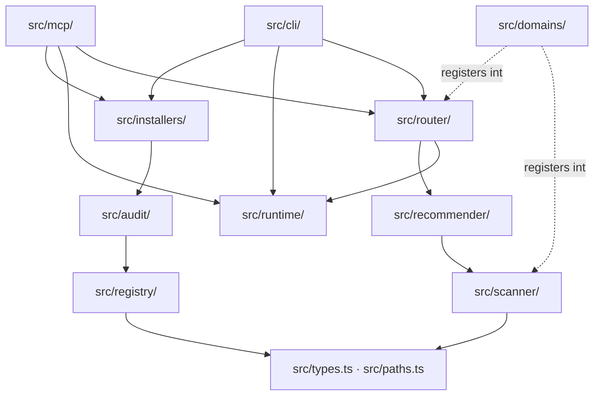

# SkillRanger Architecture (Agent Guide)

Navigation-level layout and execution flows. Deep dive: [`docs/ARCHITECTURE.md`](../ARCHITECTURE.md).

## Repository map

| Path | Responsibility |
| :--- | :--- |
| `src/cli/` | CLI entry (`index.ts`), command schema (`commands.ts`), sub-handlers for task/runs/visual-eval/release |
| `src/mcp/` | stdio JSON-RPC server, protocol, tool registry; `tools/` holds the tool groups |
| `src/router/` | Universal task router: trigger, vocabulary, analyzer, resolver, composer, catalog, store, reader, pipeline, runtime bridge |
| `src/runtime/` | `skill-run/` = lifecycle v1, `strict/` = strict v2, plus shared `run-lock.ts`, `verification.ts` |
| `src/registry/` | Loads and validates `registry/`; computes skill checksums |
| `src/scanner/` | Project fingerprinting + pluggable signal providers |
| `src/recommender/` | Feature vectors, scoring, lane grouping |
| `src/installers/` | Agent targets, install/uninstall/verify, managed `AGENTS.md` block |
| `src/audit/` | Static safety audit of skill packages |
| `src/lockfile/` | `skillranger.lock.json` read/write under a lock |
| `src/config/` | `skillranger.config.json` defaults, validation, digest |
| `src/domains/` | Domain-pack contract + registry; `frontend/` is the one bundled pack |
| `src/evals/` | `frontend.ts`, `router/`, `visual/` eval harnesses |
| `registry/` | Data: `frontend.*` skill packages + shared contracts |
| `domains/frontend/` | Data: domain manifest, routing vocabulary, schemas, rules, recipes, examples |
| `schemas/` | Published JSON Schemas |
| `evals/frontend/` | Frozen eval suites and briefs |
| `fixtures/` | Real project fixtures (`next-react-ts`, `vite-react-ts`, `backend-node`, `malicious-skill`) |
| `tests/` | Test files; `tests/fixtures/router-packs/` holds synthetic domain packs; `tests/fixtures/release/0.4.0/` holds the frozen 0.4.0 release evidence spec, candidate lanes, and command profiles |
| `docs/` | See the Documentation map in the root `AGENTS.md` |

## Architecture

The CLI parser, the JSON-RPC layer, and the JSON-Schema validator are all hand-written (zero
runtime dependencies). Two surfaces (CLI and MCP) call the same core services — never duplicate
logic in one.

Dependencies point one way. `src/runtime/` does not import `src/router/` (one type-only exception in
`src/runtime/strict/service.ts`). `src/cli/index.ts` reaches `src/mcp/server.ts` through a single
lazy `import()` for the `mcp` command.

## Core execution flows

- **CLI** — `parseCliInvocation` (`src/cli/commands.ts`) → `run()` in `src/cli/index.ts`, which
  offers the invocation to `handleVisualEvalCommand`, `handleTaskCliCommand`, `handleRunCliCommand`
  in order, then falls through to its own dispatch.
- **MCP** — newline-delimited JSON-RPC 2.0 over stdio, protocol `2025-06-18`, no SDK.
  `src/mcp/server.ts` → `src/mcp/protocol.ts` → `callMcpTool` in `src/mcp/tools.ts`.
- **Router** — `prepareTask` (`src/router/prepare.ts`): config → trigger → scan + packs + registry →
  per-skill metadata → routing context → `runRoutingPipeline` (`src/router/pipeline.ts`) →
  source snapshots → runtime run → journaled write to `.skillranger/runs/router/`. The runtime
  adapters — lifecycle payload construction, runtime-store dispatch, and the mandatory-read bridge —
  live in `src/router/runtime-bridge.ts`, consumed through `createRouterRuntimeBridge`.
- **Runtime** — a prepared run is either lifecycle v1 (`src/runtime/skill-run/`) or strict v2
  (`src/runtime/strict/`). Skill instructions are then served in inventory order through
  `src/router/reader.ts`, which bridges each completed read into the runtime ledger.
