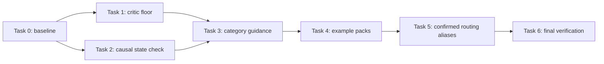

# План имплементации: visual quality и evidence gates для frontend-скиллов

**Дата:** 2026-07-26

**Статус:** ready for implementation

**Репозиторий:** SkillRanger

**Основание:** аудит Seesaw и десяти AI-сайтов, с углублённым разбором работ Kimi K3

## Цель

Минимально усилить существующий frontend visual loop так, чтобы SkillRanger:

1. не принимал визуально или технически слабый вариант только потому, что critic выбрал победителя;
2. проверял не только наличие отрисованного экрана, но и согласованность состояния после ключевого действия;
3. давал category-aware guidance и более содержательные примеры без нового монолитного skill;
4. сохранял разнообразие и не превращал каждый интерфейс в экспериментальный award-style лендинг.

Рабочая формула:

> Строить с предметной выразительностью лучших работ Kimi K3, проверять с production-дисциплиной лучших работ Opus.

## Research evidence, влияющий на план

Основные референсы Kimi K3:

- [Museum of Wind](https://museum-of-wind-0b9c.arcada.app) — цельное предметное направление и выразительный опыт, привязанный к теме;
- [Luma 01 Lamp](https://luma-01-lamp-98in.arcada.app) — продуктовый сценарий, где визуальная часть должна оставаться синхронизированной с выбранным состоянием;
- [Last Signal Aurora](https://last-signal-aurora-zsgq.arcada.app) — последовательная атмосфера и narrative progression.

Контрольная группа production-integrity:

- [Northline Rail](https://northline-rail-hzgk.arcada.app);
- [Library Study Rooms](https://library-study-rooms-dekb.arcada.app).

Из исследования в план перенесены только повторяющиеся и проверяемые выводы:

- предметная выразительность и техническая корректность — разные оси качества;
- сильная стилистика не компенсирует blank breakpoint, clipping, недоступное действие или рассинхронизированное состояние;
- Signature Move полезен только тогда, когда объясняет продукт, контент или действие;
- category-specific guidance полезнее единого «красивого» шаблона;
- существующие hard checks следует расширять только там, где найден отдельный наблюдаемый класс ошибки.

## Текущее основание в SkillRanger

План использует существующие контракты и точки расширения:

| Область | Существующий механизм | Решение |
| --- | --- | --- |
| Visual critique | `VisualCriticReport` с десятью score-критериями | Вычислить две внутренние оси из существующих scores |
| Hard findings | `compareDesignVariants` и `VerificationFinding` | Добавить hard findings при провале минимального качества |
| Browser verification | `BrowserCheckPayload` и `evaluateBrowserPayload` | Добавить один causal check |
| Blank breakpoint | `stateRendered` | Уточнить семантику, не создавать новый check |
| Internal clipping | `clippedControls` | Сохранить существующий check |
| Category guidance | visual rules, recipes и example packs | Улучшить существующие материалы |
| Router | `visual-design-polish` и aliases | Менять только при воспроизводимом routing failure |

## Решения по архитектуре

### 1. Не менять публичную critic schema

Новые `artDirectionScore` и `productionIntegrityScore` не добавляются в `VisualCriticReport`. Они вычисляются внутри `compareDesignVariants` из существующих десяти критериев.

Это сохраняет:

- schema version `1.0`;
- существующих producers и consumers;
- сохранённые отчёты;
- текущий visual-run state machine.

### 2. Добавить только один новый browser result

В `BrowserCheckPayload` добавляется:

```ts
stateSynchronization: {
  status: "verified" | "mismatch" | "not-applicable";
  path: string;
  observations: string[];
};
```

Результат описывает один наблюдаемый causal path и сохраняет как успешную
проверку, так и mismatch или явную неприменимость. Пример:

```ts
{
  status: "verified",
  path: "variant-control[Ink] -> preview.alt -> summary.variant",
  observations: ["preview.alt=Ink", "summary.variant=Ink"],
}
```

Все statuses требуют непустой `path`, идентифицирующий проверенный primary
flow. `verified` и `mismatch` требуют минимум два наблюдения зависимых
представлений. `not-applicable` допустим только когда у текущей поверхности
действительно нет state-changing primary action; `observations` тогда
содержит конкретную причину.

Не добавлять:

- отдельный `blankPage`;
- отдельный `internalClipping`;
- structured locator DSL;
- новый browser automation framework.

### 3. Не добавлять новые frontend skills и canonical intents

Category-aware поведение реализуется через существующие:

- `frontend.visual-design-polish`;
- visual rules;
- recipes;
- worked examples;
- текущий `visual-design-polish` router intent.

### 4. Не добавлять `contentMode` и `experienceArchetype` в schema на первом этапе

Существующие evidence-категории `observed / inferred / assumed / unknown`, `DesignBrief`, recipe id и правило `no-invented-proof` уже дают достаточную основу.

Новая schema допустима только после отдельного eval, показывающего, что guidance нельзя надёжно выразить существующими полями.

## Приоритеты

| Приоритет | Изменение | Причина |
| --- | --- | --- |
| P0 | Quality floor в critic | Сейчас выбранный вариант может пройти с низкими scores |
| P0 | Causal state synchronization check | Текущая проверка подтверждает render, но не связность состояния |
| P1 | Category-aware visual rules | Повышает релевантность без расширения архитектуры |
| P1 | Три более предметных example pack | Даёт агенту конкретные контрастные примеры |
| P2, confirmed | Дополнительные EN/RU aliases | Все шесть baseline-запросов сейчас не распознаются |

---

## Task 0. Зафиксировать baseline

**Изменяемые файлы:** нет.

- [ ] Убедиться, что рабочее дерево не содержит пересекающихся пользовательских изменений.
- [ ] Выполнить текущие focused tests до начала реализации.
- [ ] Сохранить результаты как baseline; не исправлять несвязанные failures.

Команды:

```bash
git status --short
node --test \
  tests/frontend-visual-critic.test.ts \
  tests/frontend-mechanical-checks.test.ts \
  tests/frontend-ui-evidence.test.ts \
  tests/mcp.visual-tools.test.ts \
  tests/design-skill-contracts.test.ts \
  tests/frontend-recipe-examples.test.ts \
  tests/frontend-intents.test.ts
npm run build
```

**Stop condition:** если baseline уже падает в затрагиваемом тесте, сначала отделить существующую проблему от планируемого изменения. Не расширять scope автоматически.

---

## Task 1 — P0. Добавить минимальный quality floor в critic

### Файлы

- Modify: `src/domains/frontend/design/critic.ts`
- Modify: `registry/skills/frontend.visual-critic/SKILL.md`
- Test: `tests/frontend-visual-critic.test.ts`

### Изменение

После полной валидации `VisualCriticReport`, но до успешного возврата выбранного варианта:

1. найти comparison и candidate для `selectedVariantId`;
2. трактовать все десять scores как quality-oriented:
   `0 = отсутствует/сломано`, `0.50 = минимально приемлемо`, `1 = отлично`;
3. для исторически названного `ai-slop-risk` явно закрепить совместимую
   семантику `0 = высокий риск`, `1 = риск отсутствует или хорошо сдержан`;
   поле не переименовывать, чтобы не ломать schema и сохранённые reports;
4. вычислить `artDirectionScore` как среднее:
   - `product-specificity`;
   - `hierarchy`;
   - `composition`;
   - `typography`;
   - `color-roles`;
   - `ai-slop-risk`;
5. вычислить `productionIntegrityScore` как среднее:
   - `state-quality`;
   - `responsive-transformation`;
   - `accessibility`;
   - `implementation-coherence`;
6. отклонить selected outcome, если:
   - `artDirectionScore < 0.60`;
   - `productionIntegrityScore < 0.60`;
   - любой production-integrity criterion `< 0.50`.

Значения оформить приватными константами внутри `critic.ts`, а не public configuration.
В `frontend.visual-critic/SKILL.md` кратко закрепить направление обеих шкал,
чтобы producer и gate не интерпретировали `ai-slop-risk` противоположно.

### Findings

Использовать три стабильных code:

- `critic-art-direction-below-floor`;
- `critic-production-integrity-below-floor`;
- `critic-integrity-criterion-below-floor`.

Finding должен содержать:

- выбранный variant id;
- вычисленное значение;
- требуемый floor;
- проваленные критерии;
- `evidenceId` выбранного candidate из
  `input.candidates.find(candidate.variantId === selectedVariantId)`.

Не брать evidence по позиции из `report.evidenceIds`: это глобальный
неупорядоченный набор, а не mapping comparison → evidence.

Severity: `high`, чтобы существующий hard-finding path блокировал принятие варианта.

### Важные ограничения

- Не менять `VisualCriticReport`.
- Не менять JSON Schema.
- Не добавлять веса, percentile, ML-calibration или пользовательскую конфигурацию.
- Не применять floor к outcome `no-acceptable-variant`: честный отказ critic остаётся валидным результатом.
- Не заменять существующую проверку `high/critical repairFindings`.

### Минимальные тесты

- [ ] Сильный selected variant проходит.
- [ ] Variant ниже art-direction floor отклоняется; case явно доказывает,
      что низкий `ai-slop-risk` score уменьшает итоговую ось согласно
      закреплённой quality-oriented семантике.
- [ ] Variant ниже production-integrity floor отклоняется.
- [ ] Один integrity criterion ниже `0.50` отклоняется даже при среднем выше `0.60`.
- [ ] `no-acceptable-variant` остаётся валидным.
- [ ] Finding ссылается на evidence выбранного candidate, даже если порядок
      `report.evidenceIds` отличается от порядка candidates.

Команда:

```bash
node --test tests/frontend-visual-critic.test.ts
npm run build
```

### Acceptance criteria

- Ни один selected variant ниже floor не возвращается как `ok: true`.
- Поведение валидных сильных reports не меняется.
- Публичные типы и schema version остаются прежними.
- Ошибка объясняет, какая ось или criterion провалены.

### Риск и контроль

**Риск:** ложное отклонение спокойного utility-first интерфейса.

**Контроль:** шкала явно калибрована семантическими anchors
`0 / 0.50 / 1`, а floor требует базового качества, а не award-style
выразительности. Повышать thresholds можно только по данным существующих evals.

---

## Task 2 — P0. Проверять causal state synchronization

### Файлы

- Modify: `src/domains/frontend/design/browser-checks.ts`
- Modify: `src/domains/frontend/design/evidence-types.ts`
- Modify: `src/domains/frontend/design/evidence.ts`
- Modify: `domains/frontend/schemas/ui-evidence-bundle.schema.json`
- Modify: `docs/browser-adapter.md`
- Test: `tests/frontend-mechanical-checks.test.ts`
- Test: `tests/frontend-ui-evidence.test.ts`
- Test: `tests/mcp.visual-tools.test.ts`
- Test fixture: `tests/helpers/frontend-visual-fixtures.ts`

### Изменение контракта

Добавить обязательное поле:

```ts
stateSynchronization: {
  status: "verified" | "mismatch" | "not-applicable";
  path: string;
  observations: string[];
};
```

Добавить `state-mismatch` в `UiCheckCode`.

`evaluateBrowserPayload` должен преобразовать `status: "mismatch"` в один
hard/high `state-mismatch`. `verified` не создаёт finding, но весь объект
сохраняется в `UiCaptureEntry.stateSynchronization`.

`not-applicable` также сохраняется и требует конкретной причины в
`observations`; пустой объект или пустые массивы не считаются доказательством.
Обновить `ui-evidence-bundle.schema.json` для нового capture-level поля, не
меняя `BrowserObservation`.

### Семантика browser adapter

Для одного ключевого state-changing действия adapter должен:

1. определить исходное состояние;
2. выполнить действие;
3. проверить минимум два зависимых представления состояния;
4. вернуть:
   - `verified` и наблюдённые значения, если все представления согласованы;
   - `mismatch` и наблюдённые значения, если хотя бы одно представление не обновилось;
   - `not-applicable` с причиной только при отсутствии state-changing primary action.

Примеры зависимых представлений:

- control → preview → summary;
- filter → result list → result count;
- room selection → schedule → booking summary;
- cart action → cart state → total;
- playback control → active item → transcript/progress.

Это не требует обхода всех controls. Проверяется один наиболее важный causal
path из primary task в подходящем capture каждого требуемого viewport.
Остальные states могут вернуть `not-applicable` с причиной.

### Уточнить существующие проверки

В `docs/browser-adapter.md` зафиксировать:

- `stateRendered: false`, если запрошенное главное состояние или основной контент отсутствует, даже когда screenshot-файл существует;
- `clippedControls` уже включает clipping внутри scroll container, card, panel и modal;
- `stateSynchronization` содержит только наблюдаемые значения, а не
  предположения о внутренней реализации;
- adapter не может возвращать `verified`, если действие не было выполнено;
- `not-applicable` нельзя использовать как silent fallback для ошибки setup.

### Минимальные тесты

- [ ] `status: "mismatch"` создаёт hard/high `state-mismatch`.
- [ ] `status: "verified"` не создаёт finding и сохраняется в capture bundle
      вместе с path и observations.
- [ ] `status: "not-applicable"` требует непустые path и причину и сохраняется без finding.
- [ ] Payload без нового обязательного поля отклоняется parser-ом.
- [ ] Existing `stateRendered: false` по-прежнему создаёт `state-not-rendered`.
- [ ] Existing `clippedControls` behaviour не меняется.

Обновить только существующие test fixtures, которые создают extended UI
evidence payload или `UiCaptureEntry`, включая MCP capture fixture.

Команда:

```bash
node --test \
  tests/frontend-mechanical-checks.test.ts \
  tests/frontend-ui-evidence.test.ts \
  tests/mcp.visual-tools.test.ts
npm run build
```

### Acceptance criteria

- Рассинхронизированное состояние не может пройти verification.
- Успешная causal проверка оставляет положительный path и наблюдения в evidence bundle.
- Неприменимость выражается явно и аудируемо, а не пустым массивом.
- Blank primary state продолжает блокироваться через `stateRendered`.
- Internal clipping продолжает блокироваться через `clippedControls`.
- Evidence bundle сохраняет `stateSynchronization`; mismatch дополнительно
  сохраняется через существующий массив `checks`.
- `BrowserObservation` и его schema не меняются.

### Риск и контроль

**Риск:** contract break для host adapter и capture fixtures, которые не отправляют новое поле.

**Контроль:** обновить adapter contract, UI evidence schema и все локальные
fixtures в одном change set; не добавлять silent fallback или compatibility
layer.

---

## Task 3 — P1. Добавить category-aware guidance в существующий skill

### Файлы

- Modify: `registry/skills/frontend.visual-design-polish/SKILL.md`
- Modify: `registry/skills/frontend.visual-design-polish/references/visual-rules.md`
- Modify: `registry/skills/frontend.visual-design-polish/references/evidence-examples.md`
- Test: `tests/design-skill-contracts.test.ts`

### Изменение

Добавить компактную матрицу applicability, которая выбирается по product evidence, primary task и существующему recipe:

| Experience shape | Приоритет | Допустимый Signature Move | Главный риск |
| --- | --- | --- | --- |
| Utility / admin / dashboard | скорость, плотность, предсказуемость | один функциональный приём | декоративная перегрузка |
| Developer tool | причинность, диагностика, точность | раскрытие system state | театральность вместо ясности |
| Commerce / configurator | media, variant, availability, cart coherence | синхронное изменение продукта | визуал расходится с выбранным вариантом |
| Editorial / content-heavy | чтение, навигация, provenance | типографический или структурный ритм | эффект мешает чтению |
| Data-heavy | сравнение, фильтрация, explanation | transformation, объясняющий данные | chart decoration без смысла |
| Portfolio / agency | авторство, отбор работ, narrative | брендовый переход или композиционный motif | скрытая навигация |
| Experimental / immersive | exploration и atmosphere | один доминирующий interaction model | inaccessible или тяжёлый spectacle |

Правила:

- Signature Move обязателен только для material visual work и должен поддерживать primary task.
- Motion не обязателен; если он используется, нужно указать функцию.
- Более выразительный layout не ослабляет hard gates.
- Calm и utility-first решения могут получить высокий critic score.
- Предметный контент должен быть `observed`, `inferred`, `assumed` или `unknown`.
- `assumed` content нельзя выдавать за клиента, метрику, награду, отзыв или production proof.

### Минимальные тесты

Добавить не более двух focused contract assertions:

- [ ] guidance различает utility и experimental applicability;
- [ ] skill требует причинную согласованность state-changing UI.

Не проверять весь prose пословно.

Команда:

```bash
node --test tests/design-skill-contracts.test.ts
npm run validate:registry
npm run lint:skills
```

### Acceptance criteria

- Один и тот же visual style не предписывается всем категориям.
- Guidance явно отделяет universal gates от category-specific choices.
- Не появляется новый skill, schema field, dependency или router intent.
- No-invented-proof становится применимым к контентным решениям, а не только общей декларацией.

---

## Task 4 — P1. Сделать три существующих example pack предметными

### Файлы

- Modify: `domains/frontend/examples/developer-tool/example.json`
- Modify: `domains/frontend/examples/e-commerce/example.json`
- Modify: `domains/frontend/examples/editorial-content/example.json`
- Regenerate: SVG-файлы только в соответствующих трёх `assets/` директориях
- Test: `tests/frontend-recipe-examples.test.ts`

### Изменение

Сохранить текущие schema, renderer и десятисценную матрицу. Этот task
улучшает предметность контента и причинные отношения через существующие
labels, порядок blocks и block kinds; он не обещает новую композиционную
грамматику. Для каждого pack изменить:

#### Developer tool

Показывать связь:

- system action;
- visible system state;
- diagnostic/recovery evidence.

Good example должен отличаться не «красивым терминалом», а ясной причинностью и recovery path.

#### E-commerce

Показывать связь:

- product/variant;
- availability;
- price/cart summary.

Good example должен сохранять один вариант продукта во всех зависимых областях.

#### Editorial content

Показывать связь:

- hierarchy;
- reading/navigation context;
- source or section context.

Good example должен улучшать сканирование и чтение, а не просто увеличивать display typography.

### Ограничения

- Не создавать новые recipe ids.
- Не менять `recipe-example.schema.json`.
- Не добавлять изображения или внешние assets.
- Использовать существующие block kinds и neutral labels.
- Не менять renderer: визуальное layout-различие между категориями не входит
  в acceptance criteria этого task.
- Не копировать композиции исследованных сайтов.

### Минимальные тесты

В существующий table-driven test добавить по одному содержательному assertion на pack:

- [ ] developer good example содержит action → state → recovery relation;
- [ ] commerce good example содержит variant → availability/cart relation;
- [ ] editorial good example содержит hierarchy → navigation/reading relation.

Затем регенерировать только затронутые SVG:

```bash
node src/domains/frontend/design/generate-example-assets.ts
node --test tests/frontend-recipe-examples.test.ts
git diff --check
```

После генерации проверить, что diff не затронул другие recipe packs. Если генератор переписал неизменённые assets, не включать их в change set.

### Acceptance criteria

- Все три pack проходят существующий validator.
- В каждом good/bad pair различие связано с задачей категории.
- Labels и порядок blocks явно выражают разные продуктовые отношения; тесты
  не выдают одинаковый renderer layout за доказательство композиционного разнообразия.
- Все 30 ожидаемых SVG существуют и соответствуют JSON.

---

## Task 5 — P2, confirmed. Дополнить routing vocabulary

### Файлы

- Modify: `src/domains/frontend/intents/en.ts`
- Modify: `src/domains/frontend/intents/ru.ts`
- Test: `tests/frontend-intents.test.ts`

### Baseline evidence

На 2026-07-26 прямой вызов `analyzeFrontendIntent` возвращает пустой набор
intents для всех шести запросов:

- `build an immersive museum experience`;
- `create a product configurator`;
- `design a data story`;
- `сделай интерактивный музейный опыт`;
- `создай конфигуратор продукта`;
- `сделай редакционный data story`.

Добавить только недостающие phrases/tokens в существующий
`visual-design-polish` alias bucket. Не менять routing weights и не добавлять
canonical intents `immersive`, `configurator`, `museum`, `data-story` и
аналогичные.

В `tests/frontend-intents.test.ts` добавить один table-driven test со всеми
шестью запросами. Сохранить или добавить рядом negative cases, доказывающие,
что общие слова `site`, `beautiful`, `modern` сами по себе не активируют intent.

Команда:

```bash
node --test tests/frontend-intents.test.ts
```

### Acceptance criteria

- Подтверждённые запросы выбирают существующий `visual-design-polish`.
- Общие слова вроде `site`, `beautiful`, `modern` не становятся сильными aliases.
- Routing weights и canonical intent surface не меняются.

---

## Task 6. Финальная пропорциональная проверка

### Обязательные focused checks

```bash
node --test \
  tests/frontend-visual-critic.test.ts \
  tests/frontend-mechanical-checks.test.ts \
  tests/frontend-ui-evidence.test.ts \
  tests/mcp.visual-tools.test.ts \
  tests/design-skill-contracts.test.ts \
  tests/frontend-recipe-examples.test.ts \
  tests/frontend-intents.test.ts
npm run build
npm run validate:registry
npm run lint:skills
git diff --check
git status --short
```

### Release gate

`npm run release:check` запускать один раз перед merge/release, а не после каждого task.

Если release gate падает в несвязанной области:

1. сохранить точную ошибку;
2. подтвердить, что focused checks проходят;
3. не исправлять unrelated code в этом change set;
4. передать отдельный follow-up владельцу соответствующей области.

## Порядок поставки



Task 1 и Task 2 независимы и могут быть реализованы отдельными change sets. Task 3 и Task 4 следует делать после P0, чтобы примеры описывали уже проверяемое поведение.

## Не внедрять в рамках этого плана

| Идея | Решение | Причина |
| --- | --- | --- |
| Новый «Kimi-style» skill | Reject | Стимулирует копирование модели и award-style convergence |
| Новые critic schema fields | Reject | Те же данные выводятся из существующих scores |
| Новый `blank-page` check | Reject | Дублирует `stateRendered` |
| Новый `internal-clipping` check | Reject | Дублирует `clippedControls` |
| `contentMode` в input schema | Defer | Сначала использовать существующую evidence taxonomy |
| `experienceArchetype` enum | Defer | Recipe, brief и rules уже покрывают выбор |
| Новые canonical router intents | Reject | Существующих aliases достаточно для подтверждённых failures |
| WebGL, 3D или scroll-animation requirement | Reject | Не универсальны, ухудшают performance/accessibility |
| Полная E2E viewport matrix | Reject | Нет evidence, что она нужна сверх focused checks |
| Новая dependency для scoring | Reject | Средние значения вычисляются локально |
| Рефакторинг visual-run state machine | Out of scope | Текущий contract достаточен |

## Definition of Done

- [ ] Selected critic outcome блокируется при провале art direction или production integrity.
- [ ] `no-acceptable-variant` остаётся допустимым исходом.
- [ ] Browser evidence блокирует наблюдаемую рассинхронизацию состояния.
- [ ] Успешная causal проверка или обоснованная неприменимость сохраняются
      как положительное аудируемое evidence.
- [ ] Blank state и clipping проверяются существующими signals без дублирования.
- [ ] Visual skill различает universal и category-specific guidance.
- [ ] Developer, commerce и editorial examples показывают разные продуктовые отношения.
- [ ] Все шесть подтверждённых routing failures закрыты существующими aliases
      без новых canonical intents или weight changes.
- [ ] Нет новых dependencies, skill packages, schema versions или speculative abstractions.
- [ ] Все focused checks и обязательные registry checks проходят.
- [ ] Diff ограничен перечисленными файлами и не затрагивает пользовательские изменения.

## Условия для последующего расширения

Новый scope разрешён только при наличии конкретного evidence:

- поднять critic thresholds — после false-positive/false-negative данных существующих evals;
- добавить `contentMode` — если минимум три независимых failures связаны с неоднозначным статусом контента;
- добавить `experienceArchetype` — если существующие recipe/brief rules системно выбирают неверное направление;
- расширить browser state paths — если один primary causal path пропускает подтверждённую регрессию;
- создать новый skill — только если проблема не решается существующими prompt, rules, critic или verification.

До появления такого evidence дополнительное расширение считается вне scope.
